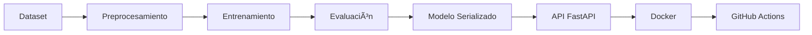

# 🧠 API de Predicción del Nivel de Obesidad

## 🚀 Proyecto MLOps utilizando FastAPI, Docker y GitHub Actions


---

# 📖 Descripción

Este proyecto implementa una solución completa de **Machine Learning** siguiendo los principios de **MLOps (Machine Learning Operations)** para predecir el **nivel de obesidad** de una persona utilizando variables antropométricas y hábitos de vida.

La solución fue desarrollada con un enfoque orientado a producción, integrando herramientas ampliamente utilizadas en la industria para el desarrollo, despliegue y mantenimiento de modelos de Machine Learning.

El proyecto contempla todo el ciclo de vida de un modelo:

- 📊 Preparación de datos
- 🤖 Entrenamiento del modelo
- 💾 Serialización del modelo
- 🌐 Exposición mediante API REST
- 📄 Documentación automática con Swagger
- 🧪 Pruebas automatizadas
- 🐳 Contenerización con Docker
- ⚙️ Integración Continua mediante GitHub Actions

---

# 🎯 Objetivos

Este proyecto tiene como objetivos principales:

- Implementar un modelo de clasificación utilizando Machine Learning.
- Exponer el modelo mediante una API REST desarrollada con FastAPI.
- Validar el funcionamiento mediante pruebas unitarias.
- Automatizar la documentación de la API con Swagger.
- Contenerizar la aplicación utilizando Docker.
- Implementar un pipeline de Integración Continua (CI).
- Aplicar buenas prácticas de desarrollo y MLOps.

---

# 📚 Tabla de Contenidos

- 📖 Descripción
- 🎯 Objetivos
- 🏗 Arquitectura General
- 🔄 Flujo MLOps
- 🛠 Tecnologías Utilizadas
- 🤖 Modelo de Machine Learning
- 📂 Estructura del Proyecto
- 📦 Instalación
- ▶️ Ejecución Local
- 🐳 Docker
- 🐳 Docker Compose
- 🌐 Endpoints
- 🧪 Testing
- ⚙️ GitHub Actions
- 📌 Conclusiones

---

# 📌 Resumen del Proyecto

| Característica | Estado |
|----------------|:------:|
| API REST | ✅ |
| Modelo entrenado | ✅ |
| Swagger | ✅ |
| Docker | ✅ |
| Docker Compose | ✅ |
| Pytest | ✅ |
| Ruff | ✅ |
| GitHub Actions | ✅ |

---

# 🏗 Arquitectura General


La arquitectura separa claramente el entrenamiento del modelo y la inferencia, permitiendo reutilizar el modelo entrenado sin necesidad de volver a entrenarlo.

---

# 🔄 Flujo MLOps



---

# 🛠 Tecnologías Utilizadas

| Tecnología | Descripción |
|------------|-------------|
| 🐍 Python 3.10 | Lenguaje de programación |
| âš¡ FastAPI | Framework para la API REST |
| 📊 Pandas | Manipulación de datos |
| 🤖 Scikit-Learn | Desarrollo del modelo |
| 🧪 Pytest | Pruebas automatizadas |
| 🎨 Ruff | Linter y calidad del código |
| 🐳 Docker | Contenerización |
| 📦 Docker Compose | Orquestación local |
| ⚙️ GitHub Actions | Integración Continua |
| 🚀 Uvicorn | Servidor ASGI |

---

# 🤖 Modelo de Machine Learning

El modelo fue desarrollado utilizando **Scikit-Learn**, implementando un algoritmo de clasificación basado en **Random Forest Classifier**.

## 📥 Variables de Entrada

- Gender
- Age
- Height
- Weight
- family_history
- FAVC
- FCVC
- NCP
- CAEC
- SMOKE
- CH2O
- SCC
- FAF
- TUE
- CALC
- MTRANS

## 🎯 Variable Objetivo

```
Obesity
```

## 📈 Algoritmo Utilizado

- Random Forest Classifier
- **Accuracy en el set de prueba:** 0.9527 (423 muestras no vistas durante el entrenamiento)

---

# 📦 Artefactos Generados

```
models/

├── model.pkl
├── encoders.pkl
└── metadata.json
```

### model.pkl

Modelo entrenado listo para realizar predicciones.

### encoders.pkl

Codificadores utilizados para transformar las variables categóricas.

### metadata.json

Contiene información relevante del modelo:

- Accuracy
- Variables utilizadas
- Variable objetivo
- Número de muestras
- Parámetros de entrenamiento

---

# 📂 Estructura del Proyecto

```text
obesity-ml-cloud-api/

│
├── app/
│   ├── __init__.py
│   ├── main.py
│   └── config.py
│   ├── predictor.py
│   └── schemas.py
│
├── training/
│   └── train.py
│   └── evaluate.py
│
├── tests/
│   └── test_api.py
│
├── models/
│   ├── model.pkl
│   ├── encoders.pkl
│   └── metadata.json
│
├── data/
│   └── Obesity_prediction.csv
│
├── .github/
│   └── workflows/
│       └── ci.yml
│
├── Dockerfile
├── docker-compose.yml
├── dockerignore
├──.env.example
├── Procfile
├── pyproject.toml
├── requirements.txt
├── README.md
└── .gitignore
```

---

# 📁 Descripción de Carpetas

| Carpeta | Descripción |
|----------|-------------|
| 📂 app | Implementación de la API REST |
| 🤖 training | Entrenamiento del modelo |
| 💾 models | Modelo entrenado y artefactos |
| 🧪 tests | Pruebas automatizadas |
| 📊 data | Dataset utilizado |
| ⚙️ .github | Pipeline de GitHub Actions |

---

# 📦 Instalación

## 1️⃣ Clonar el repositorio

```bash
git clone https://github.com/turbogarypleto/prediccion_obesidad_mlops.git

cd prediccion_obesidad_mlops
```

---

## 2️⃣ Crear un entorno virtual

### Windows

```bash
python -m venv .venv

.venv\Scripts\activate
```

### macOS / Linux

```bash
python3 -m venv .venv

source .venv/bin/activate
```

---

## 3️⃣ Instalar dependencias

```bash
pip install -r requirements.txt
```

---

# ▶️ Ejecución Local

Levantar la API:

```bash
uvicorn app.main:app --reload
```

La aplicación estará disponible en:

```
http://localhost:8000
```

Documentación Swagger:

```
http://localhost:8000/docs
```

Especificación OpenAPI:

```
http://localhost:8000/openapi.json
```

---

# 🐳 Docker

## Construir la imagen

```bash
docker build -t obesity-api .
```

## Ejecutar el contenedor

```bash
docker run -p 8000:8000 obesity-api
```

---

# 🐳 Docker Compose

Levantar el proyecto completo:

```bash
docker compose up --build
```

Detener el proyecto:

```bash
docker compose down
```

Docker Compose construye automáticamente la imagen, inicia el contenedor y deja disponible la API en el puerto **8000**.

---

# 🌐 Endpoints de la API

La API expone cinco endpoints principales para consultar el estado del servicio, obtener información del modelo y realizar predicciones individuales y por lotes.

---

## 🏠 GET /

Retorna información general de la API.

### Request

```http
GET /
```

### Response

```json
{
  "message": "Obesity Prediction API",
  "version": "1.0.0"
}
```

---

## ❤️ GET /health

Permite verificar que la API y el modelo se encuentran correctamente cargados.

### Request

```http
GET /health
```

### Response

```json
{
  "status": "ok",
  "model_loaded": true
}
```

Este endpoint es utilizado tanto por Docker como por GitHub Actions para verificar que la aplicación se encuentra operativa.

---

## 📊 GET /model/schema

Entrega la metadata del modelo entrenado.

La información incluye:

- Variables utilizadas por el modelo.
- Variable objetivo.
- Accuracy del modelo.
- Número de muestras utilizadas.
- Parámetros de entrenamiento.

---

## 🔮 POST /predict

Realiza una predicción para un único registro.

### Ejemplo de Request

```json
{
  "Gender": "Male",
  "Age": 25,
  "Height": 1.75,
  "Weight": 82,
  "family_history": "yes",
  "FAVC": "yes",
  "FCVC": 2,
  "NCP": 3,
  "CAEC": "Sometimes",
  "SMOKE": "no",
  "CH2O": 2,
  "SCC": "no",
  "FAF": 1,
  "TUE": 1,
  "CALC": "Sometimes",
  "MTRANS": "Public_Transportation"
}
```

### Ejemplo con curl

```bash
curl -X POST http://localhost:8000/predict \
  -H "Content-Type: application/json" \
  -d '{"Gender":"Male","Age":25,"Height":1.75,"Weight":82,"family_history":"yes","FAVC":"yes","FCVC":2,"NCP":3,"CAEC":"Sometimes","SMOKE":"no","CH2O":2,"SCC":"no","FAF":1,"TUE":1,"CALC":"Sometimes","MTRANS":"Public_Transportation"}'
```
### Response

```json
{
  "prediction": "Normal_Weight"
}
```

---

## 📦 POST /predict/batch

Permite enviar múltiples registros para obtener varias predicciones en una única solicitud.

### Response

```json
{
  "predictions": [
    "Normal_Weight",
    "Overweight_Level_I"
  ]
}
```

---

# 📑 Documentación Swagger

FastAPI genera automáticamente la documentación interactiva de la API.

Disponible en:

```
http://localhost:8000/docs
```

Además, el esquema OpenAPI puede consultarse en:

```
http://localhost:8000/openapi.json
```

Swagger permite:

- Visualizar todos los endpoints disponibles.
- Ejecutar solicitudes directamente desde el navegador.
- Revisar ejemplos de Request y Response.
- Consultar el esquema completo de la API.

---

# 🧪 Pruebas Automatizadas

El proyecto incorpora pruebas unitarias utilizando **Pytest**.

Para ejecutarlas:

```bash
python -m pytest tests/test_api.py -v
```

Las pruebas consideran los siguientes escenarios:

- ✅ Endpoint raíz.
- ✅ Endpoint Health.
- ✅ Consulta del esquema del modelo.
- ✅ Predicción válida.
- ✅ Campo obligatorio faltante.
- ✅ Valor categórico inválido.
- ✅ Predicción Batch.
- ✅ Batch con datos inválidos.
- ✅ Tipo de dato incorrecto.

Resultado esperado:

```text
==========================
9 passed
==========================
```

---

# 🎨 Calidad del Código

La calidad del código es validada utilizando **Ruff**.

Ejecutar:

```bash
ruff check .
```

Corrección automática:

```bash
ruff check . --fix
```

---

# ⚙️ Integración Continua (CI/CD)

El proyecto incorpora un pipeline automático utilizando **GitHub Actions**.

Cada vez que se realiza un **Push** o un **Pull Request**, el pipeline ejecuta automáticamente las siguientes tareas:

- Instalación de dependencias.
- Validación del código mediante Ruff.
- Ejecución de pruebas unitarias.
- Construcción de la imagen Docker.
- Ejecución del contenedor.
- Verificación del endpoint `/health`.

---

# 🔄 Pipeline de Integración Continua


---

# 📈 Flujo de Predicción


---

# 🐳 Contenerización

La aplicación fue diseñada para ejecutarse completamente mediante Docker.

Beneficios:

- 📦 Portabilidad.
- 🔄 Reproducibilidad.
- 💻 Independencia del sistema operativo.
- 🚀 Facilidad de despliegue.

---

# ✅ Buenas Prácticas Implementadas

Durante el desarrollo del proyecto se aplicaron diversas buenas prácticas de ingeniería de Machine Learning:

- Arquitectura modular.
- Separación entre entrenamiento e inferencia.
- Modelo serializado mediante Pickle.
- Validación de datos con Pydantic.
- Documentación automática mediante Swagger.
- Pruebas unitarias.
- Contenerización con Docker.
- Integración Continua mediante GitHub Actions.
- Validación de calidad utilizando Ruff.

---

# 🚀 Mejoras Futuras

Como trabajo futuro podrían incorporarse nuevas funcionalidades, entre ellas:

- 🔐 Autenticación mediante JWT.
- ☁️ Despliegue en Azure, AWS o Google Cloud.
- 📈 Monitoreo del rendimiento del modelo.
- 📊 Integración con MLflow.
- 🗄️ Registro de predicciones en una base de datos.
- 🔄 Reentrenamiento automático del modelo.
- 🚀 Pipeline de Continuous Deployment (CD).

---

# ⚠️ Troubleshooting

| Problema | Solución |
|----------|----------|
| Swagger no carga | Verificar que la API esté ejecutándose. |
| Docker no inicia | Ejecutar `docker compose down` y luego `docker compose up --build`. |
| Error `ModuleNotFoundError` | Revisar la estructura del proyecto y el PYTHONPATH. |
| No encuentra `model.pkl` | Confirmar que exista dentro de la carpeta `models`. |
| Fallan las pruebas | Ejecutar `python -m pytest tests/test_api.py -v`. |
| Error en GitHub Actions | Revisar el archivo `ci.yml` y los logs del pipeline. |

---

# 🎯 Conclusiones

Este proyecto demuestra la implementación de un flujo completo de **MLOps** para un problema de clasificación utilizando Machine Learning.

La solución integra el entrenamiento del modelo, la serialización de los artefactos, el despliegue mediante una API REST, la documentación automática, las pruebas unitarias, la contenerización con Docker y la integración continua mediante GitHub Actions.

El resultado es una aplicación modular, reproducible y preparada para ser desplegada en distintos entornos.

---

# ⚠️ Limitaciones

Si bien el proyecto cumple con los objetivos planteados para la asignatura, existen oportunidades de mejora que podrían incorporarse en una versión de producción:

- 🔒 Incorporar autenticación y autorización mediante JWT para proteger los endpoints.
- ☁️ Desplegar la API en un servicio Cloud (Azure, AWS o Google Cloud).
- 📊 Implementar monitoreo del rendimiento del modelo y de la API en producción.
- 🔄 Automatizar el reentrenamiento del modelo cuando se disponga de nuevos datos.
- 🗄️ Registrar las predicciones en una base de datos para facilitar auditorías y análisis posteriores.
- 📈 Incorporar métricas avanzadas para detectar deriva del modelo (*Model Drift*).
- 🚀 Implementar un pipeline completo de **Continuous Deployment (CD)** para automatizar el despliegue.

Estas mejoras no fueron implementadas debido al alcance académico del proyecto, pero representan una evolución natural para una solución orientada a producción.

---

# 👨‍💻 Autores

Este proyecto fue desarrollado por:

- **Cristóbal Barrientos**
- **Cristóbal Crespo**
- **Andrés López**

**Programa:** Magíster en Ciencia de Datos

**Universidad:** Universidad Adolfo Ibáñez

**Año:** 2026

# 🤖 Uso de Asistentes de IA

Durante el desarrollo de este proyecto se utilizaron asistentes de IA como
apoyo, conforme a lo permitido en la pauta de evaluación:

- **Claude (Cowork)**: revisión de la pauta de evaluación frente al estado del
  repositorio, identificación de brechas respecto a la rúbrica, corrección del
  pipeline de CI/CD, validación de entradas de la API, y redacción del
  borrador del informe técnico.

---

# 📄 Licencia

Este proyecto fue desarrollado con fines académicos para la asignatura de **MLOps** del programa de **Magíster en Ciencia de Datos** de la **Universidad Adolfo Ibáñez**.

Su uso es exclusivamente educativo.

